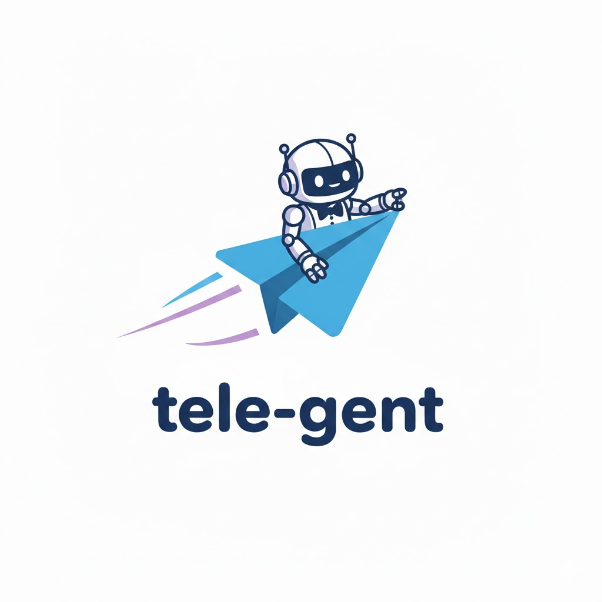
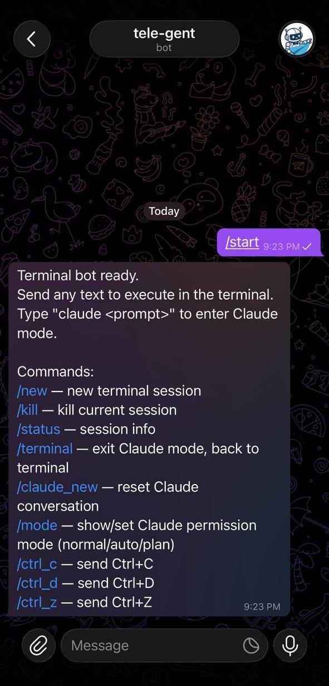
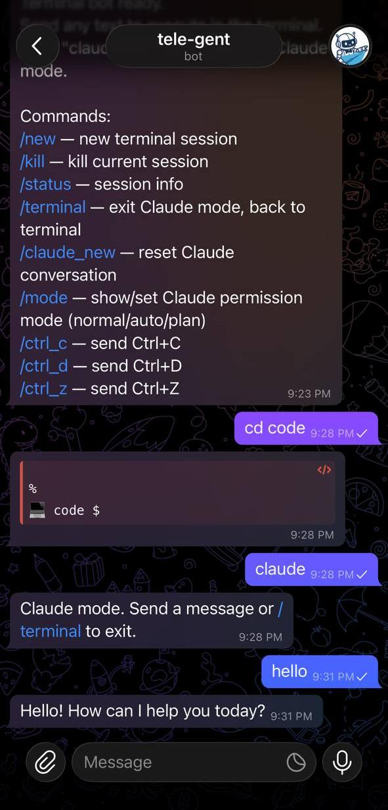
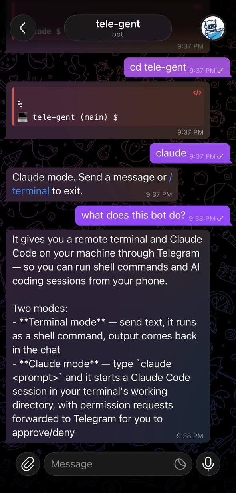

<p align="center">
  
</p>

# tele-gent

tele-gent: Telegram + AI agent. Remote terminal and [Claude Code](https://docs.anthropic.com/en/docs/claude-code) on your machine — from your phone.

## Features

**Terminal mode** — a full shell session over Telegram. Send commands, get output, send control signals (`^C`, `^D`, `^Z`). Upload images with captions to pass files into your session.

**Claude mode** — type `claude <prompt>` to start a Claude Code session. It runs in your terminal's working directory with full tool access. Permission requests show up in the chat for you to approve or deny.

Three Claude permission modes:
- `normal` — asks before each tool use
- `auto` — runs without permission checks
- `plan` — enables planning mode

## Screenshots

<p align="center">
  
  
  
</p>

## Setup

### 1. Create a Telegram bot

1. Open Telegram and message [@BotFather](https://t.me/BotFather)
2. Send `/newbot` and follow the prompts to pick a name and username
3. BotFather will give you a **bot token** — save it, you'll need it below

### 2. Get your Telegram user ID

Message [@userinfobot](https://t.me/userinfobot) on Telegram — it'll reply with your numeric user ID. This locks the bot so only you can use it.

### 3. Install Claude Code

tele-gent uses the [Claude Code CLI](https://docs.anthropic.com/en/docs/claude-code) under the hood. Install it with npm:

```bash
npm install -g @anthropic-ai/claude-code
```

Then run `claude` once to authenticate with your Anthropic API key. The bot calls `claude` directly, so it needs to be on your PATH and already logged in.

### 4. Install pipx

[pipx](https://pipx.pypa.io/) installs Python CLI tools in isolated environments.

```bash
# macOS
brew install pipx

# Ubuntu/Debian
sudo apt install pipx

# Fedora
sudo dnf install pipx
```

Then run `pipx ensurepath` and open a new terminal.

### 5. Clone and run setup

```bash
git clone https://github.com/timstarkk/tele-gent.git
cd tele-gent
./setup.sh
```

Requires Python 3.10+ on macOS or Linux. Windows is not supported (the bot uses Unix PTY for terminal sessions).

The setup script will:
- Install tele-gent as a CLI command via pipx
- Copy the permission hook into `~/.claude/hooks/`
- Add the `PreToolUse` hook to `~/.claude/settings.json` (without overwriting your existing config)
- Prompt for your bot token and user ID, save them to `.env`

> The hook only activates when Claude is launched by the bot (via the `TELEBOT_SESSION_ID` env var). It won't interfere with normal interactive Claude usage.

### 6. Run

```bash
cd tele-gent
tele-gent
```

You'll get a "Terminal bot started" message in Telegram when it's ready.

**Optional env vars:**
- `TELEBOT_START_DIR` — starting directory for the shell (defaults to `~`)
- `TMPDIR` — temp directory for permission files (defaults to `/tmp`)

## Usage

### Commands

| Command | Description |
|---|---|
| `/start` | Show help |
| `/new` | Start a new terminal session |
| `/kill` | Kill the current session |
| `/status` | Show session info |
| `/terminal` | Exit Claude mode |
| `/claude_new` | Reset Claude conversation |
| `/mode [normal\|auto\|plan]` | Show or set Claude permission mode |
| `/ctrl_c` | Send Ctrl+C |
| `/ctrl_d` | Send Ctrl+D |
| `/ctrl_z` | Send Ctrl+Z |

### Terminal mode

Send any text to execute it as a shell command. Use `^C`, `^D`, `^Z` as shortcuts for control signals. Send `.` to press Enter.

Send a photo with a caption to save the image and pass the path + caption to your terminal.

### Claude mode

Type `claude` to enter Claude mode, or `claude <prompt>` to jump straight in. Follow-up messages continue the conversation. Send `^C` to cancel a running request, or `/terminal` to switch back.

When in `normal` mode, Claude will ask permission before running tools — reply `y` or `n`.

## Security

Access is restricted to a single Telegram user ID. No one else can interact with the bot.

## License

MIT
